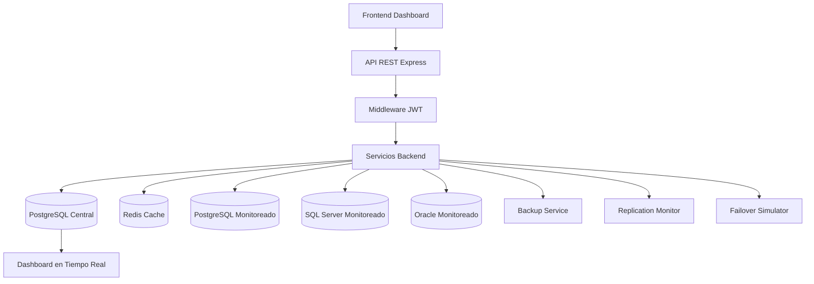

<div align="center">


# 🚀 DataOps Control Center

### Plataforma Inteligente de Monitoreo de Bases de Datos

### Universidad Mariano Gálvez de Guatemala
### Facultad de Ingeniería en Sistemas
### Base de Datos II


---

## 👨‍💻 Desarrollado por

### Fernando Zuñiga

### Proyecto Final — DataOps Control Center

</div>

---

# 📘 Descripción General

**DataOps Control Center** es una plataforma web desarrollada para monitorear, supervisar y administrar diferentes motores de bases de datos desde un dashboard centralizado.

El sistema permite registrar conexiones, verificar disponibilidad, visualizar métricas, generar alertas críticas, analizar consultas, simular concurrencia, administrar backups, monitorear replicación y simular eventos de failover.

El objetivo principal del proyecto es construir una solución académica con enfoque profesional, aplicando conceptos de **Base de Datos II**, administración de motores, monitoreo, seguridad, caché, respaldos, replicación y visualización de datos.

---

# 📑 Tabla de Contenido

1. Características principales
2. Módulos implementados
3. Arquitectura general
4. Tecnologías utilizadas
5. Estructura del proyecto
6. Instalación
7. Ejecución
8. Usuarios y roles
9. Endpoints principales
10. Base de datos
11. Flujo de monitoreo
12. Docker
13. Pruebas recomendadas
14. Estado del proyecto
15. Mejoras futuras

---

# ✅ Características Principales

- Dashboard web moderno e interactivo.
- API REST desarrollada con Node.js y Express.
- Autenticación JWT.
- Roles ADMIN y VIEWER.
- Monitoreo de PostgreSQL, SQL Server y Oracle.
- Health Check manual.
- Redis Cache con HIT/MISS.
- Slow Query Analyzer.
- Alert Engine.
- Historial de monitoreo.
- Simulación de concurrencia y locks.
- Simulación de Backup & Recovery.
- Monitoreo de replicación y replica lag.
- Simulación de failover.
- Exportación CSV.
- Docker Compose.
- Frontend modular con JavaScript.
- Gráficas con Chart.js.

---

# 🧩 Módulos Implementados

| Módulo | Descripción | Estado |
|---|---|---|
| Módulo 1 | Registro de motores y conexiones | ✅ Completado |
| Módulo 2 | Health Check automático/manual | ✅ Completado |
| Módulo 3 | Slow Query Analyzer | ✅ Funcional |
| Módulo 4 | Concurrencia y TX_LOG | ✅ Funcional |
| Módulo 5 | Backup & Recovery | ✅ Funcional |
| Módulo 6 | Replicación y Replica Lag | ✅ Funcional |
| Módulo 7 | Redis Cache | ✅ Completado |
| Módulo 8 | Dashboard BI Web | ✅ Funcional |
| Módulo 9 | Alert Engine | ✅ Funcional |
| Extra | JWT + Roles | ✅ Completado |
| Extra | Failover Simulation | ✅ Funcional |

---

# 🏗️ Arquitectura General



El sistema está dividido en capas:

- **Frontend:** interfaz web, filtros, tablas, gráficas y dashboard.
- **Backend:** API REST, autenticación, servicios y controladores.
- **Base de datos central:** PostgreSQL para almacenar logs, métricas, usuarios y eventos.
- **Redis:** caché para mejorar rendimiento.
- **Docker:** contenedores para servicios principales.

---

# 🛠️ Tecnologías Utilizadas

| Tecnología | Uso |
|---|---|
| Node.js | Backend |
| Express.js | API REST |
| PostgreSQL | Base de datos central |
| Redis | Caché |
| Docker | Contenedores |
| Docker Compose | Orquestación |
| HTML5 | Frontend |
| CSS3 | Diseño |
| JavaScript | Lógica frontend |
| Chart.js | Gráficas |
| bcryptjs | Encriptación de contraseñas |
| jsonwebtoken | Autenticación JWT |
| pg | Conector PostgreSQL |
| mssql | Conector SQL Server |
| oracledb | Conector Oracle |
| node-cron | Automatización |

---

# 📁 Estructura del Proyecto

```text
DataOps-Control-Center/
│
├── backend/
│   ├── src/
│   │   ├── controllers/
│   │   ├── routes/
│   │   ├── services/
│   │   ├── middlewares/
│   │   ├── scripts/
│   │   ├── jobs/
│   │   ├── db/
│   │   └── app.js
│   │
│   ├── Dockerfile
│   ├── .env
│   └── package.json
│
├── frontend/
│   ├── services/
│   ├── ui/
│   ├── app.js
│   ├── config.js
│   ├── index.html
│   ├── login.html
│   ├── login.js
│   └── styles.css
│
├── docs/
├── docker-compose.yml
└── README.md
```

---

# ⚙️ Instalación

## 1. Clonar el repositorio

```bash
git clone <URL_DEL_REPOSITORIO>
cd DataOps-Control-Center
```

## 2. Instalar dependencias del backend

```bash
cd backend
npm install
```

## 3. Configurar variables de entorno

Crear archivo `.env` dentro de `backend/`:

```env
PORT=3000
DB_HOST=localhost
DB_PORT=5432
DB_NAME=dataops_control_center
DB_USER=dataops
DB_PASSWORD=dataops123
JWT_SECRET=analisisdesistemasIIreu
JWT_EXPIRES_IN=8h
REDIS_URL=redis://localhost:6379
```

## 4. Levantar contenedores

Desde la raíz del proyecto:

```bash
docker compose up -d
```

## 5. Levantar backend

```bash
cd backend
npm run dev
```

## 6. Abrir frontend

Abrir con Live Server:

```text
frontend/login.html
```

---

# 🔐 Usuarios y Roles

## ADMIN

```text
Usuario: admin
Contraseña: admin123
```

Permisos:

- Visualizar dashboard.
- Ejecutar Check manual.
- Acceder a módulos administrativos.
- Consultar métricas y alertas.

## VIEWER

```text
Usuario: viewer
Contraseña: viewer123
```

Permisos:

- Visualizar dashboard.
- Consultar métricas.
- Consultar alertas.
- No puede ejecutar acciones administrativas.

---

# 🔌 Endpoints Principales

## Autenticación

```http
POST /api/auth/login
```

## Conexiones

```http
GET /api/connections
GET /api/connections/:id
GET /api/connections/:id/check
```

## Métricas

```http
GET /api/metrics
GET /api/db-metrics
GET /api/dashboard
GET /api/system-status
```

## Alertas

```http
GET /api/alerts
```

## Backups

```http
GET /api/backups
POST /api/backups/simulate
```

## Replicación

```http
GET /api/replication
POST /api/replication/simulate
```

## Failover

```http
GET /api/failover
POST /api/failover/simulate
```

## Concurrencia

```http
POST /api/transactions/simulate
```

---

# 🗄️ Base de Datos

Tablas principales:

| Tabla | Propósito |
|---|---|
| users | Usuarios, roles y contraseñas encriptadas |
| connections | Conexiones monitoreadas |
| health_logs | Historial de health checks |
| db_metrics | Métricas avanzadas |
| alert_log | Alertas generadas |
| query_log | Consultas analizadas |
| tx_log | Transacciones y locks |
| cache_metrics | Métricas Redis HIT/MISS |
| backup_history | Historial de backups |
| replica_status | Estado de replicación |
| failover_events | Eventos de failover |

---

# 📊 Dashboard Web

El dashboard muestra:

- Total de conexiones.
- Conexiones activas.
- Alertas críticas.
- Estado general del sistema.
- Métricas avanzadas.
- Historial reciente.
- Gráfica de rendimiento.
- Backups recientes.
- Replicación.
- Eventos de failover.
- Filtros por nombre, motor y estado.
- Exportación CSV.

---

# 🚀 Redis Cache

Redis se utiliza para optimizar consultas repetitivas.

Funciones implementadas:

- Cache HIT.
- Cache MISS.
- TTL.
- Limpieza de caché después de actualizar estados.
- Registro en `cache_metrics`.

---

# 📈 Slow Query Analyzer

El sistema registra consultas ejecutadas por el backend.

Información registrada:

- Query ejecutada.
- Duración en milisegundos.
- Filas retornadas.
- Clasificación FAST, MEDIUM, SLOW o CRITICAL.
- Fecha de ejecución.

---

# 🔒 Concurrencia y TX_LOG

El sistema simula transacciones y registra:

- Session ID.
- Tipo de operación.
- Inicio y fin.
- Tiempo de espera.
- Tipo de lock.

Locks simulados:

- SHARED.
- EXCLUSIVE.
- DEADLOCK.
- TIMEOUT.

---

# 💾 Backup & Recovery

Módulo académico funcional para registrar backups simulados.

Información registrada:

- Tipo de backup.
- Archivo generado.
- Tamaño en MB.
- Duración.
- Restore point.
- Estado.

---

# 🔁 Replicación y Replica Lag

El sistema simula monitoreo de replicación primaria-réplica.

Registra:

- Base primaria.
- Base réplica.
- Replica lag.
- Estado HEALTHY o WARNING.
- Fecha de revisión.

---

# ⚠️ Failover Simulation

El sistema permite simular caída de la base primaria y activación de réplica.

Registra:

- Primaria.
- Réplica.
- Motivo.
- Tiempo de recuperación.
- Estado FAILOVER_ACTIVE.

---

# 🧪 Pruebas Rápidas

## Login

```bash
curl -X POST http://localhost:3000/api/auth/login \
-H "Content-Type: application/json" \
-d '{"username":"admin","password":"admin123"}'
```

## Conexiones

```bash
curl http://localhost:3000/api/connections \
-H "Authorization: Bearer TU_TOKEN"
```

## Backup

```bash
curl -X POST http://localhost:3000/api/backups/simulate \
-H "Content-Type: application/json" \
-H "Authorization: Bearer TU_TOKEN" \
-d '{"backup_type":"FULL"}'
```

## Replicación

```bash
curl -X POST http://localhost:3000/api/replication/simulate \
-H "Authorization: Bearer TU_TOKEN"
```

## Failover

```bash
curl -X POST http://localhost:3000/api/failover/simulate \
-H "Authorization: Bearer TU_TOKEN"
```

## Transacciones

```bash
curl -X POST http://localhost:3000/api/transactions/simulate \
-H "Authorization: Bearer TU_TOKEN"
```

---

# 🐳 Docker

Servicios utilizados:

- PostgreSQL.
- Redis.
- pgAdmin.
- Backend Node.js.

Comando recomendado:

```bash
docker compose up -d
```

---

# 🧯 Problemas Comunes

## Puerto 3000 ocupado

```bash
kill -9 $(lsof -ti :3000)
```

## Docker no responde

Cerrar y abrir Docker Desktop, luego ejecutar:

```bash
docker ps
```

## Token inválido

Generar un nuevo login y reemplazar el token en las pruebas.

---

# 📌 Estado Final del Proyecto

El proyecto cuenta con un nivel funcional avanzado para una práctica final de Base de Datos II.

Cobertura estimada:

```text
Backend: 90% - 95%
Frontend: 85% - 90%
Integración general: 90% - 92%
Defendible para entrega: 95%
```

---

# 🔮 Mejoras Futuras

- Exportación PDF.
- WebSockets en tiempo real.
- Prometheus.
- Grafana.
- Auditoría completa por usuario.
- Notificaciones por correo o Telegram.
- Integración con Kubernetes.
- Replicación real completa en producción.
- Backups reales hacia nube.

---

# 🏁 Conclusión

DataOps Control Center logró evolucionar a una plataforma integral de monitoreo de bases de datos, integrando seguridad, monitoreo multi-motor, caché, alertas, análisis de consultas, transacciones, backups, replicación y failover.

El proyecto aplica conceptos importantes de Base de Datos II y los combina con tecnologías modernas de desarrollo web, APIs REST, contenedores Docker y prácticas de DataOps.

<div align="center">

## ⭐ Proyecto Final — Base de Datos II

### Universidad Mariano Gálvez de Guatemala
### Ingeniería en Sistemas

</div>
