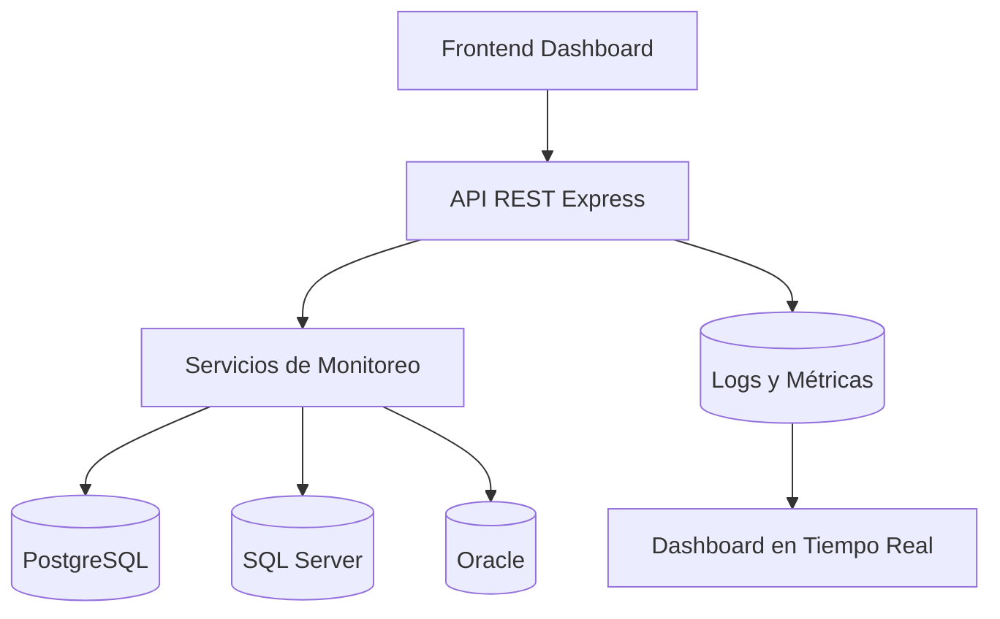

<div align="center">


# 🚀 DataOps Control Center

### Sistema Profesional de Monitoreo de Bases de Datos

### Universidad Mariano Gálvez de Guatemala

### Facultad de Ingeniería en Sistemas

### Base de Datos II


---

## 👨‍💻 Desarrollado por

### Fernando Zuñiga

### Proyecto Final — DataOps Control Center

---

</div>

# 📘 DataOps Control Center

## Proyecto Final – Base de Datos II

Sistema profesional de monitoreo y supervisión de bases de datos desarrollado para la gestión centralizada de conexiones, monitoreo automático, métricas avanzadas, alertas críticas y visualización en tiempo real.

---

# 📑 Tabla de Contenido

1. Introducción
2. Objetivo General
3. Objetivos Específicos
4. Problemática
5. Arquitectura General del Sistema
6. Tecnologías Utilizadas
7. Estructura del Proyecto
8. Funcionamiento General
9. Backend
10. Frontend
11. Base de Datos
12. Monitoreo Automático
13. Métricas Avanzadas
14. Alertas Críticas
15. Sistema de Logs
16. Limpieza Automática
17. Variables de Entorno
18. Docker y Contenedores
19. API REST
20. Dashboard Web
21. Sistema de Filtros
22. Exportación CSV
23. Estado General del Sistema
24. Seguridad y Escalabilidad
25. Flujo General del Sistema
26. Instalación del Proyecto
27. Ejecución del Proyecto
28. Pruebas Realizadas
29. Problemas Encontrados y Soluciones
30. Mejoras Futuras
31. Conclusiones

---

# 🧩 1. Introducción

DataOps Control Center es una plataforma web desarrollada para centralizar el monitoreo de múltiples motores de bases de datos desde una única interfaz administrativa.

El sistema fue diseñado para supervisar conexiones en tiempo real, registrar métricas históricas, generar alertas críticas y permitir la visualización profesional del estado general de la infraestructura de bases de datos.

El proyecto implementa una arquitectura modular moderna utilizando Node.js, Express, PostgreSQL y tecnologías frontend basadas en HTML, CSS y JavaScript modular.

Además, el sistema fue diseñado pensando en escalabilidad, mantenibilidad y automatización de tareas administrativas relacionadas con monitoreo de bases de datos.

---

# 🎯 2. Objetivo General

Desarrollar una plataforma centralizada capaz de monitorear múltiples bases de datos, registrar métricas históricas y mostrar el estado de la infraestructura mediante dashboards interactivos y automatización de procesos.

---

# 📌 3. Objetivos Específicos

* Implementar monitoreo automático de bases de datos.
* Registrar historial de verificaciones.
* Mostrar métricas avanzadas en tiempo real.
* Detectar y visualizar alertas críticas.
* Permitir exportación de reportes.
* Centralizar conexiones de distintos motores.
* Implementar arquitectura modular escalable.
* Automatizar limpieza de logs históricos.
* Utilizar contenedores Docker para despliegue.
* Crear un dashboard profesional interactivo.

---

# 4. Problemática

En muchos entornos empresariales las bases de datos se encuentran distribuidas en distintos servidores y motores, dificultando el monitoreo centralizado.

Normalmente los administradores deben utilizar múltiples herramientas para revisar:

* Estado de conexiones
* Rendimiento
* Errores
* Métricas
* Alertas
* Historial de actividad

Esto genera complejidad operativa, poca centralización y dificultad para detectar problemas oportunamente.

DataOps Control Center busca resolver esta problemática mediante una única plataforma centralizada.

---

# 🏗️ 5. Arquitectura General del Sistema



El sistema está compuesto por:

## Frontend

Dashboard interactivo desarrollado en:

* HTML5
* CSS3
* JavaScript modular
* Chart.js

## Backend

API REST desarrollada en:

* Node.js
* Express

## Base de Datos Central

* PostgreSQL

## Contenedores

* Docker
* Docker Compose

## Servicios

* PostgreSQL
* Redis
* pgAdmin

---

# 6. Tecnologías Utilizadas

| Tecnología     | Uso                          |
| -------------- | ---------------------------- |
| Node.js        | Backend                      |
| Express        | API REST                     |
| PostgreSQL     | Base de datos central        |
| Redis          | Caché y servicios auxiliares |
| Docker         | Contenedores                 |
| Docker Compose | Orquestación                 |
| HTML5          | Frontend                     |
| CSS3           | Diseño                       |
| JavaScript     | Lógica frontend              |
| Chart.js       | Gráficas                     |
| node-cron      | Automatización               |
| pgAdmin        | Administración PostgreSQL    |

---

# 7. Estructura del Proyecto

```text
DataOps-Control-Center/
│
├── backend/
│   ├── src/
│   │   ├── controllers/
│   │   ├── routes/
│   │   ├── services/
│   │   ├── jobs/
│   │   ├── db/
│   │   └── app.js
│   │
│   ├── Dockerfile
│   ├── .env
│   └── package.json
│
├── frontend/
│   ├── services/
│   ├── ui/
│   ├── app.js
│   ├── config.js
│   ├── index.html
│   └── styles.css
│
├── docker-compose.yml
└── README.md
```

---

# 8. Funcionamiento General

El sistema funciona mediante un proceso automático que:

1. Consulta las conexiones registradas.
2. Verifica el estado de cada base de datos.
3. Registra métricas.
4. Genera historial.
5. Detecta errores.
6. Actualiza el dashboard.
7. Muestra alertas críticas.

Todo esto ocurre automáticamente mediante tareas programadas.

---

# 9. Backend

El backend fue desarrollado utilizando Express.

Sus principales funciones son:

* Gestión de conexiones.
* Monitoreo automático.
* Registro de logs.
* Exposición de endpoints REST.
* Generación de métricas.
* Validación de estado.
* Automatización.

---

# 10. Frontend

El frontend fue modularizado para facilitar mantenimiento y escalabilidad.

## Módulos principales

### services/

Contiene comunicación con la API.

### ui/

Contiene renderizado visual.

### app.js

Archivo principal de control.

### config.js

Configuración centralizada.

---

# 11. Base de Datos

La base PostgreSQL central almacena:

* Conexiones registradas.
* Historial de verificaciones.
* Métricas avanzadas.
* Alertas.
* Estados del sistema.

---

# 12. Monitoreo Automático

El sistema implementa monitoreo automático mediante node-cron.

Las verificaciones se ejecutan automáticamente cada cierto intervalo configurable.

## Funciones principales

* Validar disponibilidad.
* Medir tiempos de respuesta.
* Detectar errores.
* Registrar logs.
* Actualizar estados.

---

# 13. Métricas Avanzadas

El sistema registra métricas como:

* Uso de CPU.
* Uso de memoria.
* Uso de disco.
* Locks activos.
* Deadlocks.
* Tiempo de respuesta.
* Conexiones activas.

Estas métricas se visualizan en tiempo real.

---

# 14. Alertas Críticas

Cuando una conexión presenta errores, el sistema genera alertas críticas visibles en el dashboard.

Esto permite identificar rápidamente problemas de disponibilidad.

---

# 15. Sistema de Logs

Cada verificación realizada genera registros históricos.

Los logs almacenan:

* Estado.
* Mensaje.
* Tiempo de respuesta.
* Fecha.
* Base de datos monitoreada.

---

# 16. Limpieza Automática

El sistema implementa limpieza automática de logs antiguos.

Esto evita crecimiento excesivo de la base de datos.

Se eliminan automáticamente:

* health_logs antiguos.
* db_metrics antiguos.

---

# 17. Variables de Entorno

El backend utiliza variables de entorno mediante `.env`.

Ejemplo:

```env
PORT=3000
DB_HOST=localhost
DB_PORT=5432
DB_NAME=dataops_control_center
DB_USER=dataops
DB_PASSWORD=dataops123
MONITOR_INTERVAL_SECONDS=30
```

---

# 🐳 18. Docker y Contenedores

El sistema utiliza Docker Compose para administrar:

* PostgreSQL
* Redis
* pgAdmin
* Backend

## Comando principal

```bash
docker compose up --build
```

---

# 🔌 19. API REST

## Endpoints principales

### Obtener conexiones

```http
GET /api/connections
```

### Obtener métricas

```http
GET /api/metrics
```

### Obtener métricas avanzadas

```http
GET /api/db-metrics
```

### Obtener alertas

```http
GET /api/alerts
```

### Estado general del sistema

```http
GET /api/system-status
```

### Ejecutar check manual

```http
GET /api/connections/:id/check
```

---

# 📊 20. Dashboard Web

El dashboard permite:

* Visualización en tiempo real.
* Filtros dinámicos.
* Exportación CSV.
* Alertas críticas.
* Estado general del sistema.
* Historial de verificaciones.
* Visualización gráfica.

---

# 21. Sistema de Filtros

El sistema permite filtrar conexiones por:

* Nombre.
* Motor.
* Estado.

Esto facilita búsqueda rápida de conexiones.

---

# 22. Exportación CSV

El dashboard permite exportar historial de monitoreo en formato CSV.

Esto facilita análisis externo y generación de reportes.

---

# 23. Estado General del Sistema

El endpoint `/api/system-status` permite verificar:

* Estado backend.
* Estado base de datos.
* Total de conexiones.
* Conexiones activas.
* Conexiones con error.
* Total de logs.
* Total de métricas.

---

# 24. Seguridad y Escalabilidad

El sistema fue diseñado con enfoque modular.

## Características implementadas

* Variables de entorno.
* Frontend modular.
* Separación de responsabilidades.
* Dockerización.
* Automatización.
* Configuración centralizada.
* Manejo de errores.

---

# 25. Flujo General del Sistema

```text
Dashboard Frontend
        ↓
API REST Express
        ↓
Servicios de Monitoreo
        ↓
Motores de Base de Datos
        ↓
Registro de Logs y Métricas
        ↓
Visualización en Tiempo Real
```

---

# ⚙️ 26. Instalación del Proyecto

## Clonar repositorio

```bash
git clone <repositorio>
```

## Instalar dependencias backend

```bash
cd backend
npm install
```

## Configurar variables de entorno

Crear archivo `.env`.

## Levantar servicios

```bash
docker compose up --build
```

---

# ▶️ 27. Ejecución del Proyecto

## Backend

```bash
cd backend
npm run dev
```

## Frontend

Abrir `frontend/index.html` mediante Live Server.

---

# 28. Pruebas Realizadas

Se realizaron pruebas de:

* Monitoreo automático.
* Conexiones PostgreSQL.
* Conexiones SQL Server.
* Conexiones Oracle.
* Exportación CSV.
* Filtros.
* Dashboard.
* Alertas.
* Métricas.
* Cron jobs.
* Docker.

---

# 29. Problemas Encontrados y Soluciones

## Problema

Errores de host en Docker.

## Solución

Ajuste de hosts según entorno:

* localhost
* postgres
* host.docker.internal

---

## Problema

Errores de monitoreo por variables de entorno.

## Solución

Configuración centralizada mediante `.env`.

---

# 30. Mejoras Futuras

* Sistema de autenticación JWT.
* Notificaciones por correo.
* Dashboard administrativo avanzado.
* Reportes PDF.
* Monitoreo distribuido.
* Integración Prometheus.
* Integración Grafana.
* Roles de usuario.
* Auditoría avanzada.

---

# 🏁 31. Conclusiones

---

<div align="center">

## ⭐ Proyecto desarrollado utilizando tecnologías modernas de DataOps y monitoreo de infraestructura.

### Universidad Mariano Gálvez de Guatemala

### Ingeniería en Sistemas

### Base de Datos II

</div>

DataOps Control Center logró implementar exitosamente una plataforma centralizada de monitoreo de bases de datos utilizando tecnologías modernas y arquitectura escalable.

El sistema permite supervisar múltiples motores de bases de datos desde un único dashboard, automatizando procesos de monitoreo, registro de métricas y generación de alertas.

Además, el proyecto fue desarrollado utilizando principios de modularidad, automatización y escalabilidad, permitiendo futuras mejoras sin necesidad de reestructurar completamente la arquitectura.

La implementación de Docker, monitoreo automático y frontend modular convierte el sistema en una solución sólida para ambientes académicos y profesionales orientados a administración de infraestructura de bases de datos.
